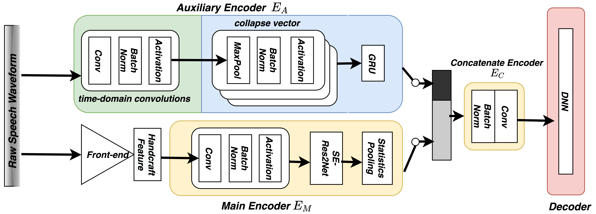

# Overview

This repository is an implementation of the Auxiliary Raw Net (ARawNet), which is ASVSpoof detection system taking both raw waveform and handcrafted features as inputs, with a limited increment of computational costs. The [paper](https://arxiv.org/abs/2109.02773) can be checked here.

The model performance is tested on the ASVSpoof 2019 Dataset.

## Setup 

### Environment

Show details

* speechbrain==0.5.7
* pandas
* torch==1.9.1
* torchaudio==0.9.1
* nnAudio==0.2.6
* ptflops==0.6.6

-   Create a conda environment with  `conda env create -f environment.yml`.
-   Activate the conda environment with  `conda activate `.

``

### Data preprocessing
    .
    ├── data                       
    │   │
    │   ├── PA                  
    │   │   └── ...
    │   └── LA           
    │       ├── ASVspoof2019_LA_asv_protocols
    │       ├── ASVspoof2019_LA_asv_scores
    │       ├── ASVspoof2019_LA_cm_protocols
    │       ├── ASVspoof2019_LA_train
    │       ├── ASVspoof2019_LA_dev
    │       
    │
    └── ARawNet

1. Download dataset. Our experiment is trained on the Logical access (LA) scenario of the ASVspoof 2019 dataset. Dataset can be downloaded [here](https://datashare.is.ed.ac.uk/handle/10283/3336).
2. Unzip and save the data to a folder  `data`  in the same directory as  `ARawNet` as shown in below.

    
3. Run ``python preprocess.py``  Or you can use our processed data directly under "/processed_data".

### Train 

`python train_raw_net.py yaml/RawSNet.yaml --data_parallel_backend -data_parallel_count=2`

### Evaluate
  `python eval.py`

### Check Model Size and multiply-and-accumulates (MACs)
`python check_model_size.py yaml/RawSNet.yaml `

## Model Performance
### Accuracy metric

min t−DCF =min{βPcm (s)+Pcm(s)} 

Explanations can be found here: [t-DCF](https://arxiv.org/abs/1804.09618)

### Experiment Results

|   |Front-end    | Main Encoder| E_A  | EER | min-tDCF |
|---| ----------- | ----------- | ---- | --- | ----     | 
|[Res2Net](https://ieeexplore.ieee.org/abstract/document/9413828)| Spec        |  Res2Net |-     | 8.783 | 0.2237 |
|   | LFCC        |             |-     | 2.869 | 0.0786 |
|   | CQT         |             |-     | 2.502 | 0.0743 |
| [Rawnet2](https://ieeexplore.ieee.org/abstract/document/9414234) | Raw waveforms |Rawnet2 |-     | 5.13   | 0.1175|
|ARawNet|Mel-Spectrogram  | [XVector](https://ieeexplore.ieee.org/abstract/document/8461375)  | :heavy_check_mark:  | **1.32**| **0.03894**| 
|   |             |             |   -   |    2.39320    |    0.06875   |
| ARawNet  |  Mel-Spectrogram | [ECAPA-TDNN](https://arxiv.org/abs/2005.07143)   | :heavy_check_mark:|   **1.39** | **0.04316**   |
|   |             |             |   -   |      2.11 | 0.06425   |
| ARawNet |     CQT    |   XVector   |  :heavy_check_mark: |   **1.74**| **0.05194**      |
|   |             |             |   -   |     3.39875 | 0.09510     |
| ARawNet  |      CQT  |  ECAPA-TDNN  | :heavy_check_mark: |   **1.11**| **0.03645**   |
|   |             |             |    -  |   1.72667 | 0.05077      |

| Main Encoder | Auxiliary Encoder | Parameters | MACs |
| --- | --- | --- | --- |
Rawnet2 | - | 25.43 M | 7.61 GMac
Res2Net | - |  0.92 M | 1.11 GMac
XVector | :heavy_check_mark: | 5.81 M  | 2.71 GMac
XVector | - |  4.66M | 1.88 GMac
ECAPA-TDNN | :heavy_check_mark:  | 7.18 M | 3.19 GMac
ECAPA-TDNN | - | 6.03M |  2.36 GMac

## Cite Our Paper

If you use this repository, please consider citing:

@inproceedings{Teng2021ComplementingHF,
  title={Complementing Handcrafted Features with Raw Waveform Using a Light-weight Auxiliary Model},
  author={Zhongwei Teng and Quchen Fu and Jules White and M. Powell and Douglas C. Schmidt},
  year={2021}
}

@inproceedings{Fu2021FastAudioAL,
  title={FastAudio: A Learnable Audio Front-End for Spoof Speech Detection},
  author={Quchen Fu and Zhongwei Teng and Jules White and M. Powell and Douglas C. Schmidt},
  year={2021}
}
